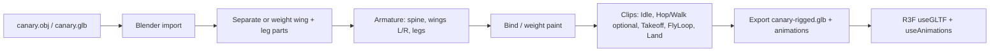

# Society Canary Game — Products DevNet Plan

| Field | Value |
| --- | --- |
| **Status** | In progress — branch `game-prototype` |
| **Date** | 2026-08-07 |
| **Related** | `DEVNET.md` (hosting context); `reference.jpg` (Anything World bird rotation target) |
| **Goal** | Small Product: Society members + Three.js canary; **first** ship a **fly loop** |

---

## Active pipeline (HITL) — fly loop first

We are **not** building the full member-gate Product yet. Current path:

1. **CP0** — `/game` sandbox: solid canary + grid only (rest pose) → **you review**
2. **CP1** — mesh analysis + rest orthographics → **you review**
3. **CP2** — CLI static **fly pose** (wings spread, paws tucked) aligned to `reference.jpg` → **you review**
4. **CP3** — upload static mesh to **Anything World Animate Anything** (bird) → download fly clip → **you review**
5. **CP4** — play animated GLB on `/game` → **you review**

**Out for now:** UniRig, local ML auto-rig, takeoff/land polish, member wallet gate (later).

**Reference:** `reference.jpg` — Anything World front/side/top flight pose guides.

**App entry:** `http://localhost:3000/game` on branch `game-prototype`.

### Progress

| CP | Status | Notes |
| --- | --- | --- |
| CP0 `/game` sandbox | Done | Solid mesh, no FX, static lights, grid |
| CP1 analysis | Done | `scripts/canary-rig/out/analysis.json` — Z longest (beak–tail), Y height, X thin (folded wings) |
| CP2 static fly pose | **FAILED** | CLI vertex deform butchered the mesh; discarded. `/game` restored to original `canary.glb`. See `scripts/canary-rig/ANATOMY_NOTES.md` + real canary flight refs. Next: careful Blender, not numpy “wing open”. |
| CP3 Anything World | Pending | Upload OBJ after you approve pose |
| CP4 play AW anim | Pending | — |

**CLI:** `scripts/canary-rig/README.md`  
**Retune pose:** `scripts/canary-rig/.venv/bin/python scripts/canary-rig/pose_fly_static.py --wing-deg 55 --leg-deg 45`

---

## 1. Intent (what we are *not* doing)

We are **not** porting the full KappaSigmaMu Society UI to DevNet.

We **are** shipping a **new, small Product** that:

1. Loads as a Polkadot Product (`*.dot` / `*.dev-dot.li`).
2. Authenticates via the **host wallet** (connect / pick account).
3. Checks that the address is a **live Kusama Society member** (read-only RPC to production Kusama Asset Hub).
4. Unlocks a **short 3D canary experience** (Three.js + existing canary mesh), with a path to **flying**.

Signing Society extrinsics is **out of scope**. Membership is verified by chain **reads** only.

---

## 2. Product concept

### Player fantasy

You prove you are a cyborg (Society member). The host wallet is your badge. Inside, the Kusama canary becomes *yours* — idle, hop/walk if we recover old clips, then **takeoff and fly**.

### Gate

```
Open Product → Connect host wallet → Resolve SS58 → Query Society.Members on Kusama AH
  → member? unlock game
  → not member? clear “members only” state + optional link to ksmsociety.io
```

| Level (existing app vocabulary) | Access |
| --- | --- |
| `cyborg` (in `Members`) | **In** |
| `candidate` / `bidder` / `human` | **Out** (unless we later add “spectate” — not v1) |
| Suspended | **Out** (same as non-member for v1; can show specific copy later) |

Reuse logic from `src/chain/society/queries.ts` (`getSocietyMembersEntries` / `getAccountLevelFromCollections`) — **do not** pull the whole dashboard.

### Auth assumptions (aligned with earlier DevNet analysis)

| Capability | v1 expectation |
| --- | --- |
| Host connect (`injectedWeb3.spektr` / Product SDK wallet) | **Required** — primary path |
| Extension wallets in iframe | Optional nice-to-have; do not depend on them |
| Society **reads** over public Kusama WSS | **Required** — smoke-test early; if sandbox blocks WSS, game cannot gate honestly |
| Society **writes** (bid, vote, …) | **Out of scope** |
| Full Society app features | **Out of scope** |

---

## 3. Game scope (keep it small)

### v1 (ship)

- **One scene**: sky / simple ground or void + canary.
- **Camera**: orbit or fixed follow; mobile-friendly.
- **States**: `locked` → `gate` (connect) → `checking` → `denied` | `play`.
- **Play mode**:
  - Canary **idle** (subtle motion).
  - Optional **hop / walk** if we find or recreate old clips.
  - **Fly** as the headline feature (see §5 — needs model work).
- **Controls**: keyboard + on-screen (WASD / drag / space = takeoff or flap).
- **Win condition (minimal)**: e.g. stay airborne N seconds, or reach a floating ring — one goal is enough.
- **No multiplayer**, no on-chain scores (optional later: Bulletin / local high score).

### Explicit non-goals for v1

- Full Society dashboard, bidding, voting, PoI gallery.
- PolkaVM contracts / CDM.
- Replacing production `ksmsociety.io`.
- Perfect cinematic flight physics.

---

## 4. What we already have in-repo

| Asset / code | Location | Notes |
| --- | --- | --- |
| Canary GLB | `public/static/canary.glb`, `public/assets/canary.glb`, `src/static/canary.glb` (~126 KB) | Same static mesh (OBJ→GLB lineage) |
| Canary OBJ | `public/assets/canary.obj` | Source mesh; useful for Blender re-import |
| Viewer | `src/canary-component/` (`ThreeCanary`, wireframe, bloom, particles) | **Presentation**, not a game; **no skeletal animation** |
| Membership helpers | `src/chain/society/queries.ts` | `cyborg` = in `Members` |
| Host/wallet patterns | `src/helpers/wallets.ts`, `AccountContext` | Full app path; Product may use a **thin** host-only connect |
| Three stack | `@react-three/fiber`, `drei`, `three`, postprocessing | Already in `package.json` |

### Animation archaeology

- Branch `integrate-canary` / history around canary integration: **viewer component**, not hop/walk clips.
- Branch `fix-approve-reject-animation`: **UI** approve/reject animation naming, **not** 3D canary clips.
- GLB string probe: **no** `Animation` / `Skin` / `Bone` markers in the shipping canary GLB.

**Conclusion:** hop/walk/idle clips are **not in main tree today**. They may live in personal Blender files, another drive, or an uncommitted export. Treat recovery as a **search task**; treat **rig + fly** as new art work either way.

---

## 5. 3D / animation pipeline (the hard part)

Flying is **not** “import another clip on the current mesh.” The current canary is a **static mesh**. Flight needs pose changes: **wings open**, **legs/paws tuck**, **wing beat cycle**, plus root motion or camera-relative flight.

### Recommended art path



### Clip set (minimum for “flying works”)

| Clip | Purpose |
| --- | --- |
| `Idle` | Loop on ground; subtle head/body |
| `Takeoff` | One-shot: crouch → wings spread → paws retract → leave ground |
| `FlyLoop` | Loop: wing flaps + slight body bob; legs tucked |
| `Land` | One-shot: wings fold → paws down → settle |

Optional later: `Hop`, `Walk` if recovered or cheap to author after the rig exists.

### Mesh constraints (must decide in Blender)

1. **Wings** — If the mesh is a single welded body with wings fused, **spreading wings requires either**:
   - **rig + weight paint** on wing vertices, or
   - **split meshes** (left/right wing objects parented to bones), or
   - **shape keys / morph targets** (spread pose as a morph — weaker for continuous flap).
2. **Paws/legs** — Same: need bones or separate parts to retract for flight silhouette.
3. **Topology** — Prefer keeping visual fidelity of the known canary; do not start from a random bird unless the brand look is lost.

### In-engine animation (after rigged GLB)

- `@react-three/drei` `useAnimations` + `AnimationMixer`.
- State machine: `idle ↔ takeoff → flyLoop ↔ land → idle`.
- Flight movement: **code-driven** transform (velocity, altitude, bank) while `FlyLoop` plays — do not bake full path into the clip.
- Fallback if art slips: **procedural** wing rotation on split wing meshes (less pretty, still “flying”).

### Where to put art deliverables

```
public/static/canary-game/
  canary-rigged.glb    # armature + clips
  README.md            # Blender version, export settings, clip names
```

Keep legacy `canary.glb` for the existing site viewer; **do not** break `ThreeCanary` on production pages.

---

## 6. App architecture (lean Product)

Prefer a **small surface** inside this monorepo (or a thin sub-app) rather than loading the whole Society SPA.

### Suggested shape

```
src/canary-game/                 # new
  App.tsx                        # gate + scene shell
  auth/
    HostWalletConnect.tsx        # spektr / product-sdk connect only
    useSocietyMember.ts          # address → Members check
  chain/
    kusamaClient.ts              # minimal PAPI client (Asset Hub only)
  scene/
    CanaryScene.tsx              # R3F canvas
    CanaryModel.tsx              # rigged GLB + mixer
    FlightController.tsx         # input + physics-lite
  ui/
    GateScreen.tsx
    DeniedScreen.tsx
    Hud.tsx
```

**Entry:** either

- **A.** New route `/canary-game` behind product build flags (shares webpack), or  
- **B.** Separate Vite entry `canary-game/` for a tiny Product-only bundle (cleaner for `pad`).

**Recommendation:** **B** if Product bundle size matters; **A** if you want max reuse of PAPI/descriptors with minimal tooling change. For DevNet, **B** is usually better (small upload, no full Society UI).

### Membership check (sketch)

```ts
// Read-only: production Kusama Asset Hub
const members = await api.query.Society.Members.getEntries()
const isMember = members.some(({ keyArgs: [id] }) => isSameAddress(id, address))
```

No signing. Cache result for the session; re-check on account switch.

### Host wallet (sketch)

1. Prefer Product SDK `SignerManager` / host accounts when inside host.  
2. Fall back to `window.injectedWeb3` (e.g. `spektr`) with `enable` + `accounts.get`.  
3. Do **not** require Talisman et al. for v1 Product path.

### Kusama RPC risk (same as DEVNET.md)

If the product iframe blocks outbound `wss:` to Kusama, the membership gate cannot run. Mitigations:

1. Early smoke deploy of a **gate-only** stub.  
2. Failure UI: “Cannot reach Kusama from this host” + link to `ksmsociety.io`.  
3. Do not fake membership offline (except a **dev flag** for local art work: `REACT_APP_SKIP_MEMBER_GATE=1`).

---

## 7. DevNet packaging (simplified)

Same Product loop as docs, **without** full-app adjustments:

1. Static build of the canary-game app.  
2. `pad ./dist kappasigmamu-canary.dot --env devnet --mnemonic "$MNEMONIC"` (name TBD; stem ≥ 9 chars).  
3. `polkadot-app-deploy.config.ts` with display name e.g. **“Society Canary”**.  
4. Dual life: production Society site stays as-is; this Product is a **member perk / experiment**.

Suggested names: `kappasigmamu-canary`, `society-canary`, `cyborg-canary`.

---

## 8. Workstreams & order

```text
W0  Asset hunt          Find old hop/walk/idle (disk, Drive, Blender, other repos)
W1  Gate spike          Host connect + Members read inside a minimal Product iframe
W2  Art: rig            Blender: wings / legs / armature on canary mesh
W3  Art: fly clips      Takeoff + FlyLoop + Land (+ Idle)
W4  Playable prototype  R3F scene + state machine + one objective (local, skip gate)
W5  Integrate gate      Wire W1 into W4; deny non-members
W6  Polish + pad        HUD, mobile, product config, DevNet publish
```

**Critical path:** W1 (prove auth + Kusama read) and W2–W3 (prove fly is possible on *this* mesh) can run **in parallel**. Do not build a large game loop until both green.

### Go / no-go

| Checkpoint | Pass | Fail |
| --- | --- | --- |
| **Gate smoke** | Host returns accounts; Members query returns true/false for known addresses | Abort Product claim of “members only” or fix RPC/host |
| **Rig smoke** | Wings open + legs tuck in Blender export; clip plays in a three.js sandbox | Fallback: procedural wing parts, or redesign mesh |
| **v1 ship** | Member enters, flies, one goal; non-member blocked | Do not market as complete |

---

## 9. PR / delivery plan (lightweight)

| PR | Title | Contents |
| --- | --- | --- |
| **PR0** | `chore(canary-game): scaffold + local skip-gate mode` | Package/entry, empty scene, `SKIP_MEMBER_GATE` for art |
| **PR1** | `feat(canary-game): host connect + Society member gate` | Thin chain + wallet; Gate/Denied UI |
| **PR2** | `assets(canary-game): rigged GLB + idle/fly clips` | Art only; document export; preview page |
| **PR3** | `feat(canary-game): flight controller + v1 objective` | Playable loop on rigged model |
| **PR4** | `feat(canary-game): product metadata + pad deploy` | Config, scripts, DevNet checklist |

Optional: PR that extracts shared `isSocietyMember(address)` into a tiny module used by both main app and game (avoid circular deps).

---

## 10. Risks

| Risk | Severity | Mitigation |
| --- | --- | --- |
| Static mesh cannot spread wings cleanly | High | Early Blender spike; split meshes or re-topo wing region |
| Old animations never found | Medium | Re-author Idle only; skip hop/walk for v1 |
| Host cannot sign / extensions missing | Low for this plan | We only need **accounts**, not Society txs |
| Kusama WSS blocked in sandbox | High for gate | Early smoke; honest failure UI |
| Scope creep into full Society port | High | This doc is the scope wall; point people to `DEVNET.md` only for deploy ops |

---

## 11. Open questions (product / art)

1. **Strict members only**, or allow candidates as “training mode” with grounded canary only?  
2. **Name** for DotNS / Browse card?  
3. **Where** do old animation files live (confirm offline search)?  
4. **Who** owns Blender rig work — you, a 3D collaborator, or procedural fallback first?  
5. **Monorepo route vs separate Vite app** for the Product bundle?  
6. Keep **wireframe cyber aesthetic** of current `ThreeCanary` or solid/PBR canary for flight readability?

---

## 12. Success definition

**v1 is done when:**

1. A Society member connects with the host wallet and enters the scene.  
2. A non-member sees a clear deny state (no fake unlock).  
3. The canary can **take off and fly** with a visible wing animation (rigged or procedural, but intentional).  
4. The Product is reachable on DevNet under a `.dot` name without shipping the rest of the Society app.

---

## 13. Next concrete actions (this week)

1. **Search** for old Blender/FBX/GLB animation exports (local + any canary repos).  
2. **Open** `public/assets/canary.obj` / `.glb` in Blender; confirm whether wings are separable.  
3. **Scaffold** gate-only Product (host accounts + one `Members` query).  
4. **Decision** after (2): full rig vs split-mesh procedural wings for first fly demo.
