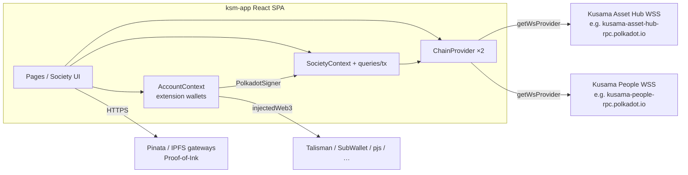
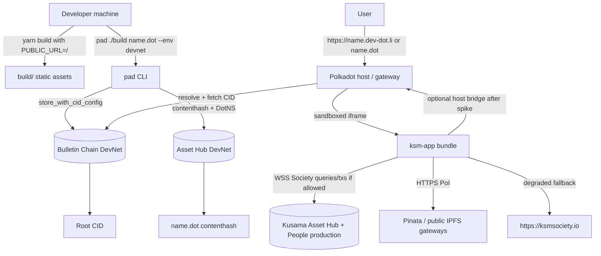
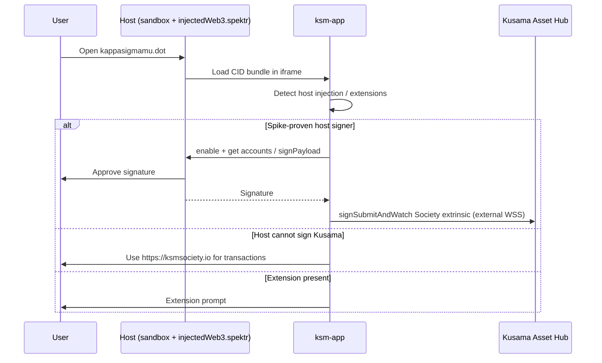
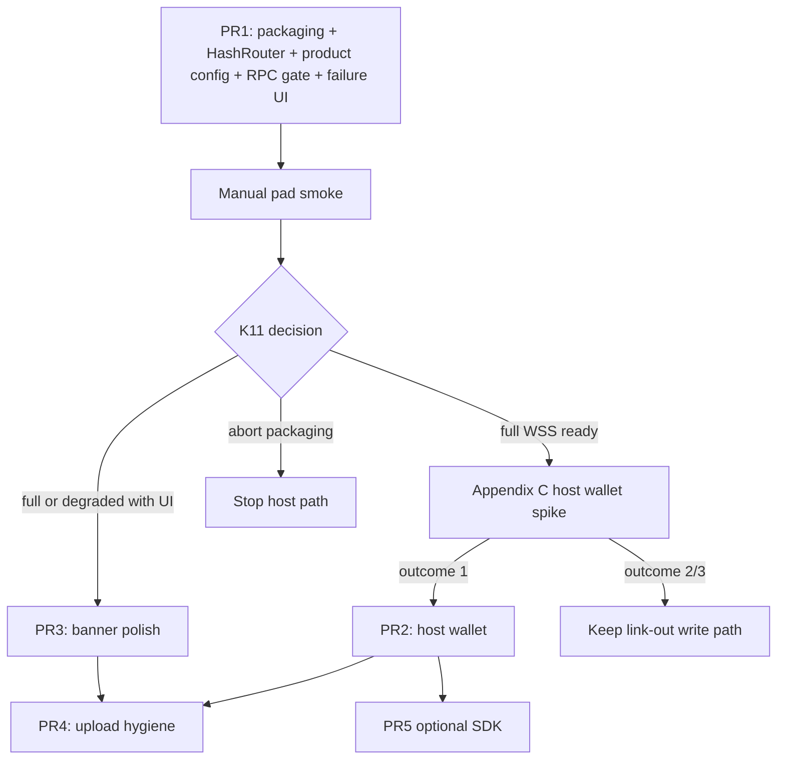

# Deploy KappaSigmaMu (Kusama Society) to Polkadot Products DevNet

| Field | Value |
| --- | --- |
| **Document title** | Deploy KappaSigmaMu (Kusama Society) app to Polkadot Products DevNet |
| **Author** | _TBD_ |
| **Date** | 2026-08-07 |
| **Status** | Approved (design review complete; ready for PR1) |
| **Repo** | `ksm-app` v2.0.1 (this repository) |
| **Audience** | Senior engineers familiar with this React SPA and Kusama Society |

---

## Overview

KappaSigmaMu is a React 19 SPA that surfaces **Kusama Society** (runtime pallet on **Kusama Asset Hub**) and identity data on **Kusama People**. It builds to a static `build/` directory (~33 MB on disk), connects via external WebSocket RPCs (`polkadot-api` + descriptors `ksmAssetHub` / `ksmPeople`), and signs with browser extension wallets through `@talismn/connect-wallets` + `getPolkadotSignerFromPjs`. Today it ships to GitHub Pages (`yarn deploy` / `gh-pages`) and Netlify (`netlify.toml` SPA rewrite), with production custom domain **`ksmsociety.io`** (`public/CNAME` / `build/CNAME`).

**Polkadot Products DevNet** is a **distribution and hosting** surface: publish a static bundle to Bulletin, bind a `.dot` name, load the app in a sandboxed host (Polkadot app or web gateway `https://<name>.dev-dot.li`). DevNet chains (Asset Hub / Bulletin / Individuality) do **not** host Society and must not replace Kusama RPCs. Host architecture routes *platform* chain access through the Host API; this app’s Society data path remains **external** `getWsProvider` to production Kusama — architecturally adversarial to the host model and therefore a first-class risk with explicit failure UX, not a silent assumption.

This design proposes a **phased hybrid**: (1) publish the existing static app with packaging/routing/security fixes and a **connection-failure shell** so the Product never “spins forever”; (2) keep all Society reads/writes on production Kusama endpoints; (3) **only after a host-wallet discovery spike**, optionally use host-injected signing when extensions cannot inject into the sandbox. Full productization onto DevNet chains or PolkaVM contracts is **out of scope and incorrect** unless Society is redeployed (it is not).

**Implementability:** Phase 1 (PR1) is ready to code. Phase 2 wallet API surface is **draft pending host probe** — not implementable as a hard Spektr allowlist until the spike documents outcomes.

---

## Background & Motivation

### Current application architecture



| Concern | Implementation today |
| --- | --- |
| Chain client | `src/chain/client.ts` — `createClient(getWsProvider(endpoints))` + `ksmAssetHub` / `ksmPeople` descriptors |
| Endpoints | `src/chain/endpoints.ts` + `src/helpers/providers.ts` / `peopleProviders.ts`; optional `?rpc=` / `?peopleRpc=` overrides via `window.location.search`; env `REACT_APP_PROVIDER_SOCKET` / `REACT_APP_PEOPLE_PROVIDER_SOCKET` |
| Provider UI | `src/components/SettingsDropdown.tsx` mutates **outer** URL `searchParams` and navigates via `href` |
| Society state | `src/chain/society/*` — queries against `api.query.Society.*`, txs via `submitTx` + `PolkadotSigner` |
| Wallet | `src/helpers/wallets.ts` (allowlist), `src/components/Wallets.tsx`, `src/account/AccountContext.tsx` |
| Routing | `BrowserRouter` in `src/pages/App.tsx`; GH Pages SPA hack in `public/index.html` + `public/404.html` |
| Loading gate | Outer `ChainProvider chain="assetHub" showLoading` blocks on Asset Hub only; nested `people` has no `showLoading` |
| Build | Custom CRA-style webpack (`config/webpack.config.js`); `yarn build` → `build/`; `package.json` `"homepage": "https://KappaSigmaMu.github.io/"` (full origin URL; CRA extracts pathname `/` → `r.p="/"` in produced `build/index.html`) |
| Deploy | `yarn deploy` → `gh-pages -d build`; Netlify `/* → /` 200 rewrite; custom domain `ksmsociety.io` via `CNAME` |
| Env | `.env.production`: `REACT_APP_NAME`, `REACT_APP_KEYRING_PREFIX=2`, Pinata keys (documented as read-only). `config/env.js` loads `${DOTENV_ENV}` file set — **not** layered onto `.env.production` when `DOTENV_ENV` is overridden |
| Bundle | ~33 MB total; largest JS ~2.2 MB `vendors.*.js`; source maps **~13 MB**; 3D assets include `public/static/gil.glb` (~4.9 MB); also ships GH Pages `404.html` + `CNAME` |

### Why DevNet hosting

- Reach users of the **Polkadot host** (mobile/desktop/web gateway) under a first-class `.dot` name without operating a separate origin for that channel.
- Keep **GitHub Pages / Netlify / `ksmsociety.io`** as the production public site; DevNet is an **additional** distribution path, not a cutover.
- Validate Product packaging (pad, DotNS, product card) with a real, non-toy app that still depends on live Kusama state.

### Pain points for DevNet specifically

1. **Chain mismatch**: Product SDK presets target DevNet Asset Hub / Bulletin / Individuality — no Society pallet. Society remains on Kusama. Host-routed `getChainAPI("devnet")` cannot replace Society reads. Product SDK `Environment` includes `"kusama"` in types but platform docs state polkadot/kusama throw at runtime until Bulletin/Individuality are live — **not** a drop-in for this app today.
2. **Sandbox**: Host loads the bundle in a sandboxed iframe; extension injection and unconstrained outbound WSS are not guaranteed. Direct `getWsProvider` is **outside** the Host API mediation model.
3. **Static hosting model**: Gateway resolves content by CID; there is no Netlify-style server rewrite for SPA deep links unless the host rewrites or the app uses hash routing.
4. **Tooling path**: Official path is `pad ./dist name.dot --env devnet`; this repo emits `build/`, not `dist/`.
5. **Existing loading UX assumes alternate public RPCs help** (`LoadingContainer`: “try changing providers in Settings”). If the sandbox blocks **all** external `wss:`, Settings cannot recover.

---

## Goals & Non-Goals

### Goals

1. Publish a Product on Products **DevNet** at a chosen `*.dot` name and `https://*.dev-dot.li` that either (a) **works for Society read**, or (b) **degrades with explicit UX** — never infinite “Connecting…”.
2. Preserve **correct Society semantics**: all pallet reads/writes target **production Kusama Asset Hub** (and People for identity) with existing PAPI descriptors.
3. Document and implement only the **codebase adjustments required** for the app to load, connect, and (where proven) sign inside the host.
4. Keep dual deploy: existing `yarn deploy` / Netlify / `ksmsociety.io` unchanged; add DevNet-specific scripts and config.
5. Ship product card metadata (name, description, icon) for Browse/host UI on first labeled publish.
6. Safe secrets handling for deploy mnemonics (env-only, never committed).
7. Default-on phishing resistance for Product builds: **ignore free-form `?rpc=` / `?peopleRpc=`** query overrides.

### Non-Goals

- Redeploying Society as a PolkaVM contract or DevNet runtime pallet.
- Replacing Pinata Proof-of-Ink with Bulletin cloud storage in v1 (optional later).
- Migrating the build system to Vite or rewriting on `@parity/product-sdk` as the sole chain layer.
- Listing in Browse via `--publish` if personhood is unavailable (nice-to-have, not blocking).
- Mainnet / non-devnet Product networks.
- Changing production GH Pages/Netlify user-facing URLs or cutting over production traffic to DevNet.
- Promising in-host Society **writes** before the host-wallet discovery spike passes.

---

## Key Decisions

| # | Decision | Rationale |
| --- | --- | --- |
| K1 | **DevNet is distribution only; Kusama remains the system of record** | Society pallet lives on Kusama Asset Hub. DevNet chains do not implement it. Product SDK `getChainAPI("devnet")` is wrong for Society state. |
| K2 | **Adopt the Minimal path for first ship; Hybrid path as follow-on PRs** | Minimal path unblocks packaging and load validation. Hybrid (host wallet) is separable and gated on discovery. |
| K3 | **Do not full-productize onto DevNet-only SDK chains** | Would break the app’s purpose. Only use Product SDK optionally for host wallet/signing after spike, not for Society queries. |
| K4 | **Use HashRouter for the DevNet build (env-gated)** | Gateway is a static CID load without guaranteed SPA path rewrites. GH Pages `404.html` / `public/index.html` query hack is useless on Bulletin. Default `REACT_APP_ROUTER` **unset** so production `yarn build` and Cypress stay on `BrowserRouter`. |
| K5 | **Force `PUBLIC_URL=/` on DevNet builds** | `homepage` is the GH Pages origin URL (`https://KappaSigmaMu.github.io/`); webpack derives pathname `/` today. DevNet build forces `PUBLIC_URL=/` so a future non-root homepage cannot poison Product asset URLs on `name.dev-dot.li`. Hygiene, not a current functional gap. |
| K6 | **Publish `build/` with `pad` (not rename project to Vite `dist/`)** | `pad` accepts any directory; document `pad ./build …`. Avoids dual build outputs. |
| K7 | **Domain stem ≥ 9 characters without personhood** | DotNS rule; recommended **`kappasigmamu.dot`**. |
| K8 | **Dual deploy forever for this phase** | DevNet is experimental. Production remains GH Pages/Netlify/`ksmsociety.io`. |
| K9 | **Mnemonic only via env / CI secret** | `pad --mnemonic "$MNEMONIC"`; never commit. Prefer throwaway deploy account for DevNet. |
| K10 | **Host wallet via injected provider first *after spike*; full Product SDK later** | Architecture notes host injects `window.injectedWeb3.spektr`. Allowlist extension is lower-risk than restructuring `AccountContext` around `SignerManager` — **but only after** a discovery spike proves Kusama-capable signing. |
| K11 | **Go/no-go on external Kusama WSS after first pad smoke** | (a) **Full Phase 1**: Asset Hub reaches `ready` → market as working Society Product. (b) **Degraded shell**: WSS blocked → may keep URL live **only** with connection-failure UI + link to `https://ksmsociety.io`; do **not** market as working Society Product. (c) **Hold/abort host path** if packaging itself fails. Host-routed Kusama is **not** available as a drop-in today. |
| K12 | **Write-path primary fallback is production site / extensions until spike proves Spektr** | If host cannot sign production Kusama Society extrinsics, in-host Product is **read-only** (when WSS works) or **shell-only** (when not); primary writes stay on `https://ksmsociety.io` with extension wallets. Soften “Phase 2 host sign = Yes” to **target, pending spike**. |
| K13 | **Product builds ignore query RPC overrides by default** | `?rpc=` phishing is Medium severity; disable when `REACT_APP_PRODUCT_SHELL=1` (set on DevNet build). Not left as an open product question — default yes; owner can reopen only with explicit acceptance of risk. |
| K14 | **Product build env via CLI overrides only (Phase 1)** | Prefer `PUBLIC_URL=/ REACT_APP_*=… yarn build` so `.env.production` still loads. Do **not** use `DOTENV_ENV=products-devnet` unless the file duplicates every required key (env loader does not layer onto `.env.production`). |

---

## Adjustments Required

Single priority table aligned with the PR Plan. Severity = order of work, not “nice-to-have for labeled publish.”

### P0 — PR1 must-have (first labeled publish)

| ID | Adjustment | Severity | PR | Detail |
| --- | --- | --- | --- | --- |
| A2 | **SPA routing: HashRouter for Product builds** | **P0** | PR1 | Env `REACT_APP_ROUTER=hash`. Default unset → `BrowserRouter` (production + Cypress). |
| A3 | **Deploy scripts for `pad ./build` with hardcoded `--env devnet`** | **P0** | PR1 | `build:products-devnet` + `deploy:devnet`; require `$MNEMONIC`. |
| A9 | **`polkadot-app-deploy.config.ts` + icon** | **P0** | PR1 | **Promoted** — first *labeled* publish needs card metadata. `path: "./build"`, icon `./public/logo512.png` (exists). |
| A5 | **WSS smoke + minimal connection-failure shell** | **P0** | PR1 | When Asset Hub stays non-ready beyond timeout / `ChainState.error` **in product shell**: explicit copy that sandbox may block external Kusama RPC; **link to `https://ksmsociety.io`**; **do not** tell users Settings will fix it. Ship criteria per K11. |
| A18 | **Disable query RPC overrides + hide Settings provider switcher in product shell** | **P0** | PR1 | Set `REACT_APP_PRODUCT_SHELL=1` on DevNet build. `endpoints.ts` ignores `?rpc=` / `?peopleRpc=`. Hide or no-op `SettingsDropdown` provider list when product shell (outer search mutation is confusing under HashRouter and is a phishing vector). |
| A1 | **Pin `PUBLIC_URL=/` on DevNet build** | **P0** (hygiene) | PR1 | Already `/` today; pin so future homepage path changes cannot break Product assets. |
| A4 | **Account setup checklist (ops)** | **P0** | — | Fund, map EVM, Bulletin auth (~100 MiB ≫ 33 MB), register name. |

### P1 — After pad smoke + host discovery spike

| ID | Adjustment | Severity | PR | Detail |
| --- | --- | --- | --- | --- |
| A6 | **Host / Spektr wallet support** | **P1** | PR2 | **Draft pending spike** (Appendix C). Do not promise in-host Society writes until spike passes. |
| A7 | **Clear UX when no wallet / host cannot sign Kusama** | **P1** | PR2 | Link-out to production for writes; empty-state copy. |
| A8 | **localStorage account restore in iframe** | **P1** | PR2 | Tolerate partition/clear; re-prompt connect. |

### P2 — Hardening / polish

| ID | Adjustment | Severity | PR | Detail |
| --- | --- | --- | --- | --- |
| A10 | **Naming / banner for DevNet Product** | **P2** | PR3 | `REACT_APP_NAME=Kusama Society (DevNet Product)` via CLI env; small banner: data is Kusama mainnet Society. |
| A12 | **GH Pages SPA redirect noise** | **P2** | — | Harmless on DevNet; leave as-is. |
| A15 | **Bundle upload hygiene** | **P2** | PR4 | Prune `*.map` (~13 MB), optional `CNAME` / `404.html` before `pad`. |

### P3 — Optional / later

| ID | Adjustment | Severity | PR | Detail |
| --- | --- | --- | --- | --- |
| A13 | **Product SDK `SignerManager` adapter** | **P3** | PR5 | Only if Spektr allowlist insufficient; still no DevNet Society queries. |
| A14 | **Browse listing `--publish`** | **P3** | — | Personhood-gated. |
| A16 | **Pinata → Bulletin for PoI** | **P3** | — | Not required. |
| A17 | **CDM / contracts** | **N/A** | — | Do not install `cdm`. |

### Removed / supersededs

| ID | Change |
| --- | --- |
| A11 (old) | **Do not** introduce `.env.products-devnet` via `DOTENV_ENV` for Phase 1 — see K14. If added later, file must **duplicate** all of `REACT_APP_NAME`, `REACT_APP_KEYRING_PREFIX`, Pinata trio, etc. |
| A5 code in “Phase 3 optional” | **Superseded** — minimal failure shell is PR1 (A5). |
| Host-sign “Yes” in wallet matrix | Softened to **target, pending spike** (K12). |

### Explicitly not required

- Changing descriptors from `ksmAssetHub` / `ksmPeople` to DevNet descriptors for Society.
- Moving Society logic to Product SDK `getChainAPI("devnet")`.
- Renaming `build/` → `dist/` in webpack.
- Node engine downgrade (app `>=24`, pad `>=22` — compatible).

### PR1 minimum checklist (implementer)

- [ ] `build:products-devnet` = CLI env prefixes + **`yarn build`** (runs `papi`)
- [ ] Env: `PUBLIC_URL=/`, `REACT_APP_ROUTER=hash`, `REACT_APP_PRODUCT_SHELL=1`, optional `REACT_APP_NAME=…`
- [ ] `HashRouter` when `REACT_APP_ROUTER=hash`; default `BrowserRouter`
- [ ] Unit test: router env switch (or App smoke asserting shell component)
- [ ] Product shell: ignore query RPC; hide Settings provider switcher
- [ ] Asset Hub connection-failure shell + link to `https://ksmsociety.io`
- [ ] `polkadot-app-deploy.config.ts` with `./build` + icon
- [ ] `deploy:devnet` hardcodes `--env devnet`, uses `$MNEMONIC`
- [ ] Manual pad smoke → apply K11 go/no-go before PR2

---

## Proposed Design

### Deployment topology



### Connectivity long-term options

| Option | Effort | Risk | Status for this app |
| --- | --- | --- | --- |
| Direct external WSS (`getWsProvider` today) | None | Sandbox/CSP may block | **Phase 1 primary**; validate immediately |
| Host-mediated Kusama RPC (if host ever exposes arbitrary-chain provider) | High | Spec unknown | Watch platform; not available as drop-in today |
| Rewrite Society to DevNet chains | N/A | No Society pallet | **Rejected** (K1/K3) |

### Recommended path: Minimal → Hybrid (gated)

#### Phase 0 — Ops bootstrap (no app code)

1. Node.js 22+ (use 24 to match app engines).
2. Install CLIs:
   ```bash
   npm i -g @polkadot-community-foundation/dotns-cli
   npm i -g @polkadot-community-foundation/polkadot-app-deploy
   # cdm not required
   ```
3. Create/fund deploy account on DevNet Asset Hub; export `MNEMONIC`.
4. `dotns account map --env devnet`
5. Bulletin authorize (example 100 MiB / 1000 txs):
   ```bash
   dotns bulletin authorize <ss58> --transactions 1000 --bytes 104857600 --env devnet
   ```
   Or use Bulletin Chain Console faucet (Products Devnet network).
6. Register domain (if not letting `pad` register):
   ```bash
   dotns lookup name kappasigmamu --env devnet
   dotns register domain --name kappasigmamu --env devnet
   ```

#### Phase 1 — Minimal Product (**only ready-to-code vertical**)

**Intent:** App loads at `https://kappasigmamu.dev-dot.li`, assets resolve; either Society **read path** works **or** users see a clear degraded shell with production linkout (K11).

##### Scripts (standardize on `yarn build` — always runs `papi`)

```json
"build:products-devnet": "PUBLIC_URL=/ REACT_APP_ROUTER=hash REACT_APP_PRODUCT_SHELL=1 REACT_APP_NAME='Kusama Society (DevNet Product)' yarn build",
"deploy:devnet": "yarn build:products-devnet && pad ./build kappasigmamu.dot --env devnet --mnemonic \"$MNEMONIC\""
```

**Do not** call `node scripts/build.js` directly — skips `papi` and can ship stale descriptors.

**Do not** set `DOTENV_ENV=products-devnet` for Phase 1 — that replaces the dotenv file set and **drops** `.env.production` keys (Pinata, keyring prefix) unless duplicated (K14). CLI env overrides leave production dotenv load intact (`dotenv` does not override already-set vars; here we only set Product-specific keys on the command line while `NODE_ENV=production` still loads `.env.production`).

##### Router switch + acceptance test

```tsx
// src/pages/App.tsx
import { BrowserRouter, HashRouter, /* … */ } from 'react-router-dom'

const AppRouterShell = process.env.REACT_APP_ROUTER === 'hash' ? HashRouter : BrowserRouter

const AppRouter = () => (
  <AppRouterShell>
    <Routes>{/* unchanged route tree */}</Routes>
  </AppRouterShell>
)
```

- Default (unset): `BrowserRouter` — **production and Cypress unchanged**.
- Unit/test note: assert `REACT_APP_ROUTER=hash` selects `HashRouter` (jest can mock env and shallow-render route shell, or document manual smoke). Prefer a small pure helper `export const getAppRouter = () => …` for testability.

Deep links:

- Production: `https://ksmsociety.io/explore/members`
- DevNet: `https://kappasigmamu.dev-dot.li/#/explore/members`

##### HashRouter vs query-param RPC / Settings (critical interaction)

Three different “search” surfaces exist today:

| Mechanism | Source of truth | Behavior under HashRouter |
| --- | --- | --- |
| `endpoints.ts` `getQueryParam` | `window.location.search` (**outer** URL) | Reads only outer `?rpc=`; **ignores** hash-local `?#/path?rpc=…` |
| `SettingsDropdown` | Sets outer `searchParams`, full page navigate via `href` | Outer `?rpc=` works **if** overrides enabled — creates dual-query confusion with hash routes |
| `LinkWithQuery` | React Router `location.search` | Under HashRouter this is **hash-internal** search — can diverge from outer `endpoints.ts` |

**Phase 1 Product policy (A18 / K13):**

1. `REACT_APP_PRODUCT_SHELL=1` → `endpoints.ts` **never** reads `?rpc=` / `?peopleRpc=` (fixed production provider lists only).
2. Hide or disable Settings provider switcher when product shell (no outer-search mutation for RPC).
3. Therefore **no need** to teach `getQueryParam` to parse hash-local query for Product builds in PR1.
4. If a future non-product HashRouter use ever needs overrides, fix a single source of truth then — out of scope for DevNet Phase 1.

##### Connection-failure shell (A5 — PR1, not optional Phase 3)

Today: `LoadingContainer` shows “Connecting to Kusama network…” and on error “try changing providers in Settings.” That is **wrong** when all external WSS is blocked.

Product shell behavior (key off **Asset Hub** only — see dual-chain note):

```text
if product shell AND assetHub state is error OR non-ready past T seconds (e.g. 15–20s):
  show full-page / modal failure UI:
    - "This Product shell cannot reach Kusama Asset Hub from the host sandbox."
    - "Society data and transactions use production Kusama, not DevNet chains."
    - Primary CTA: Open https://ksmsociety.io
    - Secondary: Retry connection
    - Do NOT suggest Settings RPC switcher
```

Implementation touchpoints: extend `LoadingContainer` and/or `ChainProvider` `showLoading` path when `REACT_APP_PRODUCT_SHELL=1`; optionally still allow inner explore `ChainError` for recoverable cases.

##### Dual-chain readiness

| Chain | `showLoading` today | Product smoke / failure shell |
| --- | --- | --- |
| **Asset Hub** | Yes (blocks app chrome) | **Required** for “Society read” success; drives failure shell |
| **People** | No | Secondary: identity display may degrade; surface non-blocking error if desired; **do not** block shell on People alone |

Smoke “Society read” = Asset Hub `ready` + Society totals/members consistent with production site. People `ready` is nice-to-have for identity UI.

##### Product config

```ts
// polkadot-app-deploy.config.ts (repo root; pad walks up from build dir)
export default {
  domain: 'kappasigmamu.dot',
  displayName: 'Kappa Sigma Mu',
  description: 'Kusama Society UI — members, bids, candidates, payouts, Proof-of-Ink.',
  icon: { path: './public/logo512.png', format: 'png' },
  executables: [{ kind: 'app', path: './build', appVersion: [2, 0, 1] }],
}
```

##### Smoke checklist post-deploy (PR1 gate)

1. Gateway shell loads; JS/CSS resolve (root public path).
2. Landing renders; `/#/explore` shows dashboard shell.
3. **Asset Hub** reaches `ready` **or** failure UI + production link appears within T seconds (never infinite spinner).
4. If ready: Society totals populate (People identity optional).
5. Settings does not offer free-form RPC switch in product shell.
6. Record K11 outcome: **full** | **degraded shell** | **abort**.
7. Wallet modal: document outcome only (extensions / none) — not a Phase 1 gate.

**No change** to `src/chain/client.ts`, descriptors, Society pallet code, or production deploy.

#### Phase 2 — Hybrid wallet (**draft pending host probe**)

**Intent:** Signing *might* work inside Polkadot host — **only if** Appendix C spike passes.



**Precondition (blocking):** Appendix C discovery spike outcomes must be recorded. Do **not** merge Spektr allowlist as “done” without:

1. Enumerate `Object.keys(window.injectedWeb3)` inside a live Product iframe on `dev-dot.li`.
2. `enable` host provider; list accounts (SS58 format, network metadata if any).
3. Attempt a **harmless** Kusama-oriented `signRaw` / `signPayload` (or document host refusal).
4. Classify: **(1)** Spektr works for Kusama Society path; **(2)** Spektr only host/DevNet → write path = production site; **(3)** SDK `SignerManager` same limitation as (2).

**API surface status:** Conceptual only until spike:

```ts
// DRAFT — do not treat extensionName as final
const SUPPORTED_WALLETS = [/* existing */, /* host key if spike says so */]
```

If Spektr is not returned by `getWallets()`, add a `BaseDotsamaWallet` subclass analogous to `NovaWallet` **after** confirming the injection key.

Keep converting to `PolkadotSigner` via `getPolkadotSignerFromPjs` in `AccountContext` so `submitTx` stays unchanged.

**Cypress:** Product env flags default **off**. PR2 must not break `wallet-connection.cy.ts` / extension-centric e2e on BrowserRouter production path. Add Product-specific tests only if a host test harness exists later.

#### Phase 3 — Optional polish

- Host `ExternalRequest` permission docs if platform enforces pattern-scoped outbound calls.
- PR4 map/`CNAME`/`404.html` prune.
- CI `workflow_dispatch` pad with protected secret.
- PR5 SDK signer adapter if allowlist path fails.

### Build & public path

| Surface | Public URL | Router | Deploy command |
| --- | --- | --- | --- |
| Production (GH Pages / **ksmsociety.io**) | `/` derived from homepage origin URL pathname | `BrowserRouter` | `yarn build && yarn deploy` |
| Netlify | `/` | `BrowserRouter` + `netlify.toml` rewrite | platform build |
| Products DevNet | force `PUBLIC_URL=/` | `HashRouter` | `yarn deploy:devnet` |

`package.json` `"homepage": "https://KappaSigmaMu.github.io/"` is a **full origin URL**, not the literal string `/`. CRA `getPublicUrlOrPath` extracts the pathname (`/`). Forcing `PUBLIC_URL=/` on DevNet builds is defensive against a future project-path homepage (e.g. `/repo/`) breaking `name.dev-dot.li` assets.

### SPA options comparison

| Option | Deep links share/refresh | Effort | Fit for Bulletin/gateway |
| --- | --- | --- | --- |
| **HashRouter (selected for Product)** | Works (`#/explore/…`) | Low (env switch) | Best without host rewrite |
| BrowserRouter + prove gateway SPA fallback | Clean URLs | Low code, high unknown | Only if smoke proves rewrite |
| BrowserRouter + GH Pages 404 hack | Works on GH Pages only | Already present | **Useless** on CID static host |
| Landing-only `/` (no deep links) | Breaks share/refresh of explore routes | Low | Poor UX; rejected as primary |

### Write-path options comparison

| Option | In-host Society writes | Effort | Risk | When |
| --- | --- | --- | --- | --- |
| Extension wallets only | Unreliable in sandbox | None | High UX failure in host | Production site primary |
| Spektr / host `injectedWeb3` allowlist | **Target, pending spike** | Medium | May refuse Kusama payloads | PR2 if spike (1) |
| Product SDK `SignerManager` | Same accounts as host | Medium–High | Likely same DevNet/product scope | PR5 if allowlist insufficient |
| Link-out to `https://ksmsociety.io` | N/A (leaves Product) | Low | Drops Product immersion | **Default write fallback** (K12) |

### Wallet matrix (expected)

| Environment | Extension wallets | Host Spektr | Society txs |
| --- | --- | --- | --- |
| ksmsociety.io / GH Pages | Yes | No | Yes (today) |
| `*.dev-dot.li` in desktop browser | Unreliable / often no | If host injects | **Target, pending spike** (read may work if WSS ok) |
| Polkadot mobile/desktop app | No | If host injects | **Target, pending spike** |

### Bundle size vs Bulletin auth

| Metric | Value | Implication |
| --- | --- | --- |
| `build/` on disk | ~33 MB | Fits within example `104857600` (100 MiB) grant |
| Largest JS | ~2.2 MB vendors | Fine for chunked ~2 MiB Bulletin uploads |
| Source maps | **~13 MB** of `.map` under `static/js` | Prune before `pad` in PR4 |
| 3D assets | `gil.glb` ~4.9 MB | Included; optional lazy path later |
| GH Pages artifacts | `404.html`, `CNAME` (`ksmsociety.io`) | Harmless if uploaded; optional prune in PR4 |

### Naming

| Candidate | Stem length | Notes |
| --- | --- | --- |
| `kappasigmamu` | 12 | **Recommended** — brand, no personhood gate |
| `kusama-society` | 14 | Clear product description |
| `ksmsociety` | 10 | Aligns with `ksmsociety.io` |
| Short names ≤8 | — | Personhood required; avoid for DevNet bootstrap |

---

## API / Interface Changes

No public HTTP API. Internal interface deltas:

### Router (Phase 1)

See Phase 1 router sketch. Env default **off**.

### Product shell endpoint gate (Phase 1)

```ts
// src/chain/endpoints.ts — conceptual
const productShell = process.env.REACT_APP_PRODUCT_SHELL === '1'

export const assetHubEndpoints = (): string[] =>
  getProviderEndpoints(
    productShell ? null : getQueryParam('rpc'),
    process.env.REACT_APP_PROVIDER_SOCKET
  )
// same for people with peopleRpc
```

### Wallet allowlist (Phase 2 — draft)

Final `extensionName` and enable path **TBD after Appendix C**. Do not ship hard-coded `spektr` without probe evidence.

### Deploy CLI surface (ops interface)

```bash
# Always pass --env devnet (pad default is NOT devnet)
export MNEMONIC='…'   # never commit
yarn deploy:devnet
dotns content view kappasigmamu --env devnet
# optional Browse listing (personhood):
pad ./build kappasigmamu.dot --env devnet --mnemonic "$MNEMONIC" --publish
```

### Product SDK (optional PR5 only)

```ts
// Illustrative — NOT used for Society chain data
import { SignerManager } from '@parity/product-sdk/wallet'
// connect → selectAccount → getSigner() → PolkadotSigner
// Society still uses createChainClient + ksmAssetHub over external WSS
```

Do **not** call `getChainAPI("devnet")` for Society queries. Do **not** assume Product SDK `kusama` environment works for Society today.

---

## Data Model Changes

**None** on-chain for Society.

| Store | Change |
| --- | --- |
| Kusama Asset Hub Society pallet | Unchanged |
| Kusama People identity | Unchanged |
| Pinata / IPFS PoI | Unchanged |
| DevNet Bulletin | New: static app DAG / CID (content hosting only) |
| DevNet DotNS | New: `kappasigmamu.dot` (or chosen name) contenthash + optional manifest/icon records |
| Browser localStorage `activeAccount` | Unchanged schema; may be less sticky in iframe |

No migrations.

---

## Alternatives Considered

### Alternative 1 — Full productization on DevNet chains + Product SDK only

Rewrite chain layer to `@parity/product-sdk` `getChainAPI("devnet")` and drop external Kusama WSS.

| Pros | Cons |
| --- | --- |
| “Idiomatic” Product | **No Society pallet** on DevNet → app loses purpose |
| Host-routed RPC / wallet | Would require redeploying Society (not planned) |
| | Massive rewrite of `src/chain/society/*` and descriptors |

**Rejected** for this product.

### Alternative 2 — Minimal static publish only (no code changes)

Run `pad ./build …` on the current production build as-is.

| Pros | Cons |
| --- | --- |
| Zero code | Deep links with `BrowserRouter` likely break on refresh/share |
| Fast experiment | Wallet/signing likely broken; infinite loading if WSS blocked |
| | No product card metadata; no dual-deploy ergonomics |

**Rejected as the sole strategy**; acceptable only as a one-off spike to test WSS/CSP, then fold learnings into Phase 1.

### Alternative 3 — Hybrid (recommended evolution)

Minimal packaging + HashRouter + product shell failure UX + host wallet **after spike**; keep Kusama RPCs.

| Pros | Cons |
| --- | --- |
| Correct Society semantics | External WSS may be restricted (must validate; K11) |
| Incremental PRs | Two wallet code paths if Spektr works |
| Works as standalone SPA and Product | Host account vs Kusama SS58 may never work (K12) |

**Selected.**

### Alternative 4 — iframe open-in-new-window escape hatch

Detect sandbox and link out to `https://ksmsociety.io` for full functionality.

| Pros | Cons |
| --- | --- |
| Zero sandbox pain | Defeats Product distribution goal if primary |
| | Poor mobile host UX if exclusive |

**Keep as primary write-path fallback (K12) and connection-failure CTA**, not as the only distribution strategy.

SPA and write-path option tables appear under Proposed Design (above).

---

## Security & Privacy Considerations

| Topic | Assessment | Mitigation |
| --- | --- | --- |
| Deploy mnemonic | High risk if leaked | Env/CI secret only; DevNet throwaway account preferred; never commit; no logging of `MNEMONIC` |
| Pinata keys in repo | Present in `.env.production` with comment “read-only” | Out of scope to rotate here; do not add write-capable keys; treat as public |
| Sandbox / Host mediation | Host is intended security boundary for signing | Prefer host signing prompts over seeds in Product; spike before trusting Spektr |
| External WSS | App talks to public Kusama RPCs outside Host API | Known public endpoints only; **Product shell disables `?rpc=`** (K13/A18) |
| XSS / bundle integrity | Content addressed on Bulletin; gateway verifies CID | Standard SPA XSS hygiene unchanged |
| Privacy | Same as production site (addresses, Society membership public on-chain) | No additional PII collection |
| DevNet vs production confusion | User might think DevNet UI is a test Society | Banner / `REACT_APP_NAME`; failure UI clarifies production Kusama |
| `--publish` / personhood | Optional | Do not automate personhood; manual |

Threat notes:

- **Severity High:** Compromised deploy key can replace Product contenthash → malicious UI phishing for Kusama signatures. **Mitigation:** protect mnemonic; monitor `dotns content view`; small trusted operator set.
- **Severity Medium:** Malicious public RPC if user is tricked into `?rpc=` override. **Mitigation (Phase 1 default):** ignore query RPC overrides when `REACT_APP_PRODUCT_SHELL=1`; hide Settings switcher.
- **Severity Low:** DevNet reset wipes name/content; no mainnet funds on DevNet deploy account by policy.

---

## Observability

| Layer | What to watch |
| --- | --- |
| Deploy | `pad` CLI success: `Verified on-chain:` + CID; store CID in release notes |
| Name resolution | `dotns content view <name> --env devnet` after each deploy |
| Runtime chain | **Asset Hub** states gate Society success; People secondary; `activeProviderEndpoint` |
| Failure shell | Metric/log once: product shell entered degraded mode (console is enough for DevNet) |
| UX | Toast errors from `submitTx` / wallet enable (already via `toastByStatus`) |
| Alerting | Manual post-deploy smoke; optional CI fetch of gateway HTML |
| Support signals | Infinite spinner without failure UI = PR1 bug; “No wallet” → missing Spektr/extensions; writes fail after connect → spike outcome (2) |

Logging: keep `console.error` paths in IPFS/wallet; do not log mnemonics or raw seed material.

---

## Rollout Plan



1. **Feature flags / env (Product build only)**
   - `PUBLIC_URL=/`
   - `REACT_APP_ROUTER=hash`
   - `REACT_APP_PRODUCT_SHELL=1` (RPC gate + failure shell + hide Settings switcher)
   - `REACT_APP_NAME=…` (CLI override; `.env.production` still loads)
2. **Staged rollout**
   - Deploy without `--publish` first.
   - Apply K11 before investing in PR2.
3. **Production coexistence**
   - Do not change `yarn deploy`, Netlify, or `ksmsociety.io`.
4. **Rollback**
   - Re-`pad` previous known-good `build/` artifact.
   - App-level: revert PRs; GH Pages unaffected.
5. **Authorization expiry**
   - Re-authorize Bulletin if upload fails after previously succeeding.

### Success criteria

| Criterion | Measure |
| --- | --- |
| Bundle live | `dotns content view` shows expected CID |
| UI loads | Landing + explore shell render on gateway |
| Never silent hang | Asset Hub ready **or** failure UI + `ksmsociety.io` CTA within T seconds |
| Society read (full mode) | Asset Hub ready; member/bid counts consistent with production site |
| People | Optional for identity; non-blocking |
| Society write (production SPA) | Existing Cypress + Chopsticks + extensions — **unchanged path** |
| Society write (Product Phase 2) | **Only if spike outcome (1):** host signature prompt for a mainnet-safe/read-only payload first; full Society write tests remain primarily on production site / Chopsticks with extensions |
| Production unharmed | `ksmsociety.io` / GH Pages still deployable with `yarn build` (BrowserRouter) + `yarn deploy` |

---

## Risks

| Risk | Severity | Mitigation |
| --- | --- | --- |
| External Kusama WSS blocked in sandbox/CSP | **High** | PR1 failure shell + K11 go/no-go; production linkout |
| Extension wallets unavailable in iframe | **High** (for txs) | K12 link-out; PR2 only after spike |
| Host Spektr cannot sign production Kusama | **High** for Phase 2 goals (was Medium) | Discovery spike; do not promise writes; production write path |
| Deep link 404 without HashRouter | **Medium** | Phase 1 HashRouter for Product build |
| Bulletin auth too small / expired | **Low–Med** | 100 MiB grant; prune ~13 MB maps; re-authorize |
| DevNet reset | **Medium** (ops) | Re-register name + redeploy |
| Confusing dual branding | **Low** | `REACT_APP_NAME` + banner (PR3) |
| Accidental pad without `--env devnet` | **High** (wrong network) | Script hardcodes `--env devnet` |
| Spektr injection name/API drift | **Medium** | Spike + feature-detect; no hardcode before probe |
| Merging wallet code when WSS is dead | **Medium** | PR2 gated on smoke + spike (merge order) |

---

## Open Questions

1. **Does the live DevNet gateway allow browser WebSocket to public Kusama RPCs from the product iframe?**  
   Answer with PR1 instrumented deploy → K11 decision. (Design no longer treats this as unowned: failure UI is required either way.)

2. **Exact injected wallet key, account networks, and whether Kusama `signPayload` is accepted?**  
   Appendix C spike — **blocks PR2 implementation detail**.

3. **Final `.dot` name ownership** — `kappasigmamu` vs `kusama-society` vs `ksmsociety`?  
   Product decision; technical default `kappasigmamu`.

4. ~~Should Product builds disable `?rpc=`?~~ **Resolved: yes by default (K13).** Reopen only with explicit product-owner risk acceptance.

5. **Is Browse listing (`--publish`) desired for the first public share?**  
   Requires personhood; can wait.

6. **CI: who holds `MNEMONIC` and should deploy be manual-only?**  
   Recommend manual or protected environment for DevNet.

7. **If gateway later guarantees SPA fallback, switch Product back to BrowserRouter?**  
   Env switch allows it; keep HashRouter until proven.

---

## References

### Codebase

- `package.json` — scripts, homepage, engines
- `src/chain/client.ts` — PAPI client
- `src/chain/endpoints.ts` — endpoint resolution (`window.location.search`)
- `src/helpers/providers.ts` — Kusama Asset Hub WSS list
- `src/helpers/peopleProviders.ts` — People WSS list
- `src/helpers/wallets.ts` — wallet allowlist
- `src/account/AccountContext.tsx` — signer bridge
- `src/chain/society/` — Society domain logic
- `src/pages/App.tsx` — router + dual ChainProviders
- `src/components/LoadingContainer.tsx` — current connect UX
- `src/components/SettingsDropdown.tsx` — outer URL RPC switcher
- `config/paths.js` — `PUBLIC_URL` / homepage
- `config/env.js` — `DOTENV_ENV` non-layered load
- `public/index.html` — GH Pages SPA hack
- `public/CNAME` — production `ksmsociety.io`
- `netlify.toml` — SPA rewrite
- `.env.production` — production React env

### External docs

- [Getting started for developers](https://docs.polkadotcommunity.foundation/getting-started/developers/)
- [Build & publish applications](https://docs.polkadotcommunity.foundation/guides/build-and-publish/)
- [Platform services SDK](https://docs.polkadotcommunity.foundation/guides/platform-services-sdk/)
- [App delivery architecture](https://docs.polkadotcommunity.foundation/architecture/app-delivery/)
- [Architecture overview (sandbox, injectedWeb3.spektr)](https://docs.polkadotcommunity.foundation/architecture/)
- [Deploy your app (playground CLI — related tooling)](https://docs.polkadot.com/apps/deploy-your-app/)
- [Polkadot Web host reference](https://docs.polkadot.com/reference/apps/hosts/polkadot-web/)

---

## PR Plan

Incremental, independently reviewable PRs. No PR rewrites Society chain logic. **Only PR1 is ready to implement without discovery work.**

### Merge order with gates

```text
PR1 (packaging + HashRouter + pad + product config + RPC gate + minimal connection failure UI)
  → manual pad smoke (load + Asset Hub WSS + failure UI if blocked)
  → K11 decision: full | degraded shell | abort host path
PR3 (banner polish) can start after PR1 lands
Appendix C spike (host wallet) only if WSS full mode OR if spike is still useful for UX messaging
PR2 (host wallet) only if spike outcome (1) — or outcome (2)/(3) limited to link-out UX polish
PR4 hygiene
PR5 optional SDK if allowlist insufficient
```

`REACT_APP_ROUTER` / `REACT_APP_PRODUCT_SHELL` default **off** so `yarn build` and Cypress stay BrowserRouter / production behavior.

### PR 1 — Products DevNet packaging, shell safety, HashRouter

- **Title:** `feat(devnet): Product build, HashRouter, pad deploy, and connection failure shell`
- **Files/components affected:**
  - `package.json` (`build:products-devnet`, `deploy:devnet`)
  - `src/pages/App.tsx` (router env switch; optional `getAppRouter` helper)
  - `src/components/LoadingContainer.tsx` and/or ChainProvider loading path (product failure shell)
  - `src/chain/endpoints.ts` (ignore query RPC when product shell)
  - `src/components/SettingsDropdown.tsx` / `Navbar.tsx` (hide provider switcher when product shell)
  - `polkadot-app-deploy.config.ts` (new)
  - Optional: `scripts/deploy-devnet.sh`, unit test for router/env gating
- **Dependencies:** None
- **Must-have (A2, A3, A9, A5, A18, A1):** HashRouter env, pad scripts with `--env devnet`, product config, connection-failure shell + `ksmsociety.io` CTA, disable `?rpc=` + hide Settings switcher, pin `PUBLIC_URL=/`.
- **Nice-to-have:** Distinct `REACT_APP_NAME` via CLI (A10 partial).
- **Description:** First ready-to-code vertical. After merge, operator runs pad smoke and records K11. Do not change wallet allowlist or Society pallet code.

### PR 2 — Host wallet detection & allowlist

- **Title:** `feat(wallet): support host-injected wallet for Product sandbox (post-spike)`
- **Files/components affected:**
  - `src/helpers/wallets.ts`
  - `src/components/Wallets.tsx` (empty-state / link-out for writes)
  - `src/account/AccountContext.tsx` only if enable path needs host-specific handling
  - Tests; ensure Cypress extension defaults still pass (BrowserRouter, no product shell)
- **Dependencies:** PR1; **Appendix C spike documented**; prefer WSS full mode (if RPC dead, wallet PR value is mostly messaging)
- **Description:** Feature-detect host provider **as proven by spike**; map to existing `getPolkadotSignerFromPjs` pipeline. If spike fails Kusama signing, ship link-out UX only — do not claim in-host Society writes.

### PR 3 — Product shell banner polish

- **Title:** `feat(devnet): product shell banner and copy polish`
- **Files/components affected:**
  - Navbar / layout banner
  - Copy that data is Kusama mainnet Society
- **Dependencies:** PR1
- **Description:** User-facing clarity. RPC gate already in PR1; this PR is presentation.

### PR 4 — Deploy hygiene

- **Title:** `chore(devnet): prune maps/CNAME/404 before pad upload`
- **Files/components affected:**
  - `scripts/deploy-devnet.sh` or package scripts (`rm -f build/**/*.map build/CNAME build/404.html` as appropriate)
  - Optional CI `workflow_dispatch` + secret
- **Dependencies:** PR1
- **Description:** Maps ~13 MB; GH Pages artifacts unnecessary on Bulletin. No runtime behavior change.

### PR 5 — (Optional) Product SDK signer adapter

- **Title:** `feat(wallet): optional Product SDK SignerManager adapter`
- **Files/components affected:**
  - New host signer adapter module; optional `@parity/product-sdk` dependency
  - Account/wallet integration behind feature detect
- **Dependencies:** PR2 path attempted; spike shows allowlist insufficient but SDK viable
- **Description:** Still **do not** route Society storage queries through DevNet `getChainAPI`.

---

## Appendix A — Operator checklist (first DevNet publish)

```bash
node --version   # >= 22 (prefer 24)
npm i -g @polkadot-community-foundation/dotns-cli
npm i -g @polkadot-community-foundation/polkadot-app-deploy

export MNEMONIC='…'          # funded DevNet account
export DOTNS_MNEMONIC="$MNEMONIC"

dotns account address
dotns account map --env devnet
# fund SS58 at DevNet faucet; authorize Bulletin storage

dotns register domain --name kappasigmamu --env devnet   # or let pad register
yarn deploy:devnet
dotns content view kappasigmamu --env devnet
# open https://kappasigmamu.dev-dot.li
# record K11: full | degraded | abort
```

## Appendix B — What “success” looks like vs production

| Capability | Production site | DevNet Product Phase 1 full | DevNet Phase 1 degraded | Phase 2 (spike pass) |
| --- | --- | --- | --- | --- |
| View Society dashboard | Yes | Yes | No (explicit UI) | Yes |
| Extension sign | Yes | Maybe | No | Maybe |
| Host sign Kusama Society | N/A | No | No | **If spike (1)** |
| Proof-of-Ink gallery | Yes | Yes if HTTPS ok | N/A | Yes if HTTPS ok |
| Browse listing | N/A | Optional | Optional | Optional |

## Appendix C — Host wallet discovery spike (PR2 precondition)

**Goal:** Answer whether in-host Society **writes** are feasible without promising them in product copy.

**Steps:**

1. Deploy any minimal or PR1 Product to DevNet; open in `dev-dot.li` and Polkadot app if available.
2. From app console (or temporary debug UI): log `Object.keys(window.injectedWeb3 || {})`.
3. For each provider: `enable('Kappa Sigma Mu')`, `accounts.get()`, note address formats.
4. Attempt `signer.signRaw` with a harmless bytes payload **and/or** a Kusama Asset Hub `signPayload` shape used by PAPI/pjs.
5. Attempt (optional) a non-Society balance transfer payload only if safe/test account — prefer read-only signRaw first.
6. Write results into the PR2 description:

| Outcome | Meaning | Product action |
| --- | --- | --- |
| **(1)** | Host signs Kusama-capable payloads; accounts useful for Society | PR2 allowlist + in-host writes |
| **(2)** | Host only DevNet/product accounts or rejects Kusama genesis | Link-out for writes; optional connect for display only |
| **(3)** | Product SDK `SignerManager` same as (2) | Skip PR5 or limit to host identity demos |

**Exit:** Spike memo committed or linked; PR2 scope frozen to that outcome.

## Appendix D — PR1 acceptance tests (file-level)

| Check | How |
| --- | --- |
| Router env | Unit test: helper returns HashRouter when `REACT_APP_ROUTER=hash`, else BrowserRouter |
| Product RPC ignore | Unit test: with `REACT_APP_PRODUCT_SHELL=1`, `assetHubEndpoints()` ignores mocked `?rpc=` |
| Production defaults | `yarn build` without Product env still BrowserRouter path; Cypress wallet specs green |
| Failure shell | Manual or component test: product shell + Asset Hub error renders production CTA, not Settings advice |
